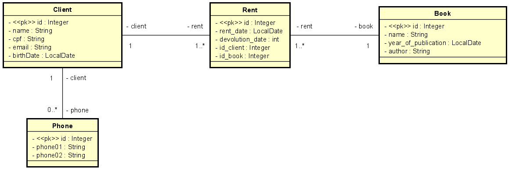

# <h1>Library API</h1>

> Status: Developing⚠️

## 🚀Technologies Used:

<table>
  <tr>
    <td>Java 17</td>
    <td>Spring Boot</td>
    <td>Lombok</td>
    <td>PostgreSQL</td>
    <td>Bean Validation</td>
  </tr>
   <tr>
      <td>17</td>
      <td>3.0</td>
  </tr>
</table>

## 📋Some fields in main Model is:

#<h3>tb_client</h3>
+ id
+ name
+ email
+ birthDate

# <h2>Data modeling for the concept</h2>
