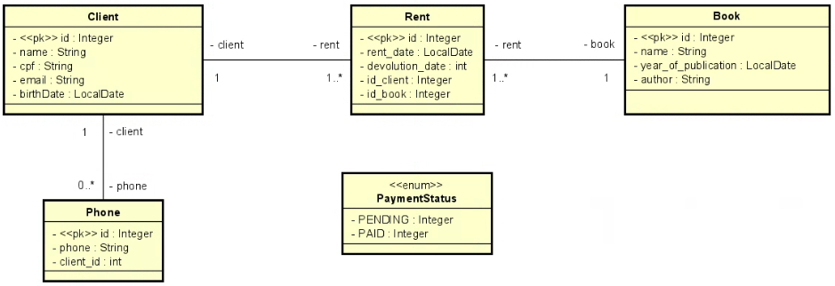

# <h1>Library API</h1>

> Status: Developing⚠️

## 📋My object with this project

The idea is to create a system for a library, simple functions, example: CRUD between books, customers and rents. Thus discovering new methods of doing something new and training.

## 🤯Features implemented in the project

1. CRUD - Customer, Book, Phone and Rental

2. Book search grouped by author

3. Based on the rent passed as a parameter, we see if the customer has any rents where the return date is past 30 days. If the deadline has expired, the system must calculate a fine of 1% for each day passed after the deadline and return the fine. Else returns 0.

## 🚀Technologies Used:

<table>
  <tr>
    <td>Java 17</td>
    <td>Spring Boot</td>
    <td>Lombok</td>
    <td>PostgreSQL</td>
    <td>Bean Validation</td>
</tr>
   <tr>
      <td>17</td>
      <td>3.0</td>
      <td>Null</td>
      <td>15.2</td>
      <td>Null</td>s
  </tr>
</table>

# <h2>Data modeling for the concept</h2>
